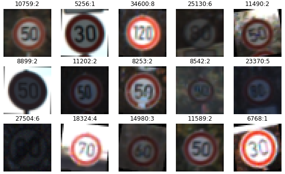

# **Traffic Sign Recognition** 

## Writeup

---

**Build a Traffic Sign Recognition Project**

The goals / steps of this project are the following:
* Load the data set (see below for links to the project data set)
* Explore, summarize and visualize the data set
* Design, train and test a model architecture
* Use the model to make predictions on new images
* Analyze the softmax probabilities of the new images
* Summarize the results with a written report

[//]: # "Image References"

[image1]: ./examples/visualization.png "Visualization"
[image2]: ./examples/new_data_distrubution.png "New Distrubution]"
[image3]: ./examples/random_noise.png "Random Noise"
[image4]: ./test_images/end_limits.png "Traffic Sign 1"
[image5]: ./test_images/maxspeed_60.png "Traffic Sign 2"
[image6]: ./test_images/maxspeed_70.png "Traffic Sign 3"
[image7]: ./test_images/stop.png "Traffic Sign 4"
[image8]: ./test_images/turn_right.png "Traffic Sign 5"

## Rubric Points

Here I will consider the [rubric points](https://review.udacity.com/#!/rubrics/481/view) individually and describe how I addressed each point in my implementation.  

---
### Writeup / README

**1. Provide a Writeup / README that includes all the rubric points and how you addressed each one. You can submit your writeup as markdown or pdf. You can use this template as a guide for writing the report. The submission includes the project code.**

You're reading it! and here is a link to my [project code](https://github.com/LinkHS/CarND-Traffic-Sign-Classifier-Project/blob/master/Traffic_Sign_Classifier.ipynb), here is the corresponding [html](https://github.com/LinkHS/CarND-Traffic-Sign-Classifier-Project/blob/master/Traffic_Sign_Classifier.html) version.

### Data Set Summary & Exploration

**1. Provide a basic summary of the data set. In the code, the analysis should be done using python, numpy and/or pandas methods rather than hardcoding results manually.**

I used the `np.array.shape`  to read summary statistics of the traffic signs data set:

* The size of training set is ?

  34799

* The size of the validation set is ?

  4410

* The size of test set is ?

  12630

* The shape of a traffic sign image is ?

  32, 32, 3

* The number of unique classes/labels in the data set is ?

  43

**2. Include an exploratory visualization of the dataset.**

Here is an exploratory visualization of the training set. It is a bar chart showing how the data is distributed. There are 43 categories, some categories have more than 2,000 samples compared to a minimum of around 200. This led to a serious imbalance problem when retrieving images in a batch during training. In next section I will describe how I addressed this issue.

![alt text][image1]

The following image randomly shows some of the original images in the training set. We can see that the brightness and angle of the traffic signs in these figures vary greatly, even coming from same classes. This gave me some inspiration, then I tried to use the relevant method to generate additional data with similar changes like brightness, rotation and etc.

### Design and Test a Model Architecture

**1. Describe how you preprocessed the image data. What techniques were chosen and why did you choose these techniques? Consider including images showing the output of each preprocessing technique. Pre-processing refers to techniques such as converting to grayscale, normalization, etc. (OPTIONAL: As described in the "Stand Out Suggestions" part of the rubric, if you generated additional data for training, describe why you decided to generate additional data, how you generated the data, and provide example images of the additional data. Then describe the characteristics of the augmented training set like number of images in the set, number of images for each class, etc.)**

As a first step, I copied the original image so that the number of images in all categories became 4,000. One reason is to prevent classifier bias caused by unequal class numbers,  another reason is to have enough images used in data augmentation step. The probability of each images chosen in same category is the same,  that is no image is copied more times than others in same class. 

I didn’t convert the images to grayscale because I believe that color plays an important role in classifying traffic signs.  I also not normalized the image data because I used batch-norm to normalize the input layer by adjusting and scaling each activation layers, which dramatically improve the performance and stability of the model.

Here is the new distribution of training data after increasing and balancing number of images for each class.

![alt text][image2]

As a last step, I I decided to generate additional data because ... 

To add more data to the the data set, I used the following techniques because ... 

Here is an example of an original image and an augmented image:

![alt text][image3]

The difference between the original data set and the augmented data set is the following.

- Rotate the original image by a certain angle (random between -10 and 10) around its center.

- Add some random noise (gaussian noise, variance = 0.001) on rotated image.

> I’d like to apply more image augmentation methods such as brightness adjustment, perspective transformation and etc., but I have to submit this project quickly as I’ve already missed the deadline.

**2. Describe what your final model architecture looks like including model type, layers, layer sizes, connectivity, etc.) Consider including a diagram and/or table describing the final model.**

My final model consisted of the following layers:

|       Layer        |                      Description                       |
| :----------------: | :----------------------------------------------------: |
|       Input        |                   32x32x3 RGB image                    |
|  Convolution 5x5   |       1x1 stride, valid padding, outputs 28x28x6       |
|     Batch Norm     |                       decay 0.9                        |
|        RELU        |                                                        |
|    Max pooling     | 2x2 kernel, 2x2 stride, valid padding, outputs 14x14x6 |
|  Convolution 5x5   |      1x1 stride, valid padding, outputs 10x10x16       |
|     Batch Norm     |                       decay 0.9                        |
|        RELU        |                                                        |
|    Max pooling     | 2x2 kernel, 2x2 stride, valid padding, outputs 5x5x16  |
|  Fully connected   |                      outputs 120                       |
|     Batch Norm     |                       decay 0.9                        |
|        RELU        |                                                        |
|      Dropout       |                        rate 0.5                        |
| Fully connected 84 |                       outputs 84                       |
|     Batch Norm     |                       decay 0.9                        |
|        RELU        |                                                        |
|      Dropout       |                        rate 0.5                        |
| Fully connected 43 |                       outputs 43                       |
|      Softmax       |                       outputs 43                       |

**3. Describe how you trained your model. The discussion can include the type of optimizer, the batch size, number of epochs and any hyperparameters such as learning rate.**

The whole training process is quite smooth. The framework and hyperparameters are based on the examples provided in the class. For example, Adam is chosen for the optimizer and batch size is kept as 128. 

At first, the validation accuracy was very low around and remaining at 0.3. I tried to print out the loss of the training set and draw the trend of loss to see if the model was partly worked. After I fixed some bugs in the code and the loss of both training and validation started to decrease. 

When the model can work, the training was in the optimization stage. I tried to reduce the learning rate and increase the batch size, but the training speed dropped significantly. I joined the batch norm to speed up the training. Another benefit from batch norm feature is that the training is not sensitive to learning rate.  With the help of batch norm, the model had become better. However, the validation accuracy still was only able to get to 0.95 while training accuracy can reach 0.99, even I increased the epoch to 100. It was obviously over fitting. To overcome over fitting, instead of using L2, I applied dropout after all fc layers. Finally validation accuracy gets to 0.97 after the 10th epoch. Due to time limits, I stopped tuning and started writing the report.

**4. Describe the approach taken for finding a solution and getting the validation set accuracy to be at least 0.93. Include in the discussion the results on the training, validation and test sets and where in the code these were calculated. Your approach may have been an iterative process, in which case, outline the steps you took to get to the final solution and why you chose those steps. Perhaps your solution involved an already well known implementation or architecture. In this case, discuss why you think the architecture is suitable for the current problem.**

My final model results were:
* training set accuracy of ?
  0.999

* validation set accuracy of ? 
  0.973

* test set accuracy of ?
  0.956

If an iterative approach was chosen:
* What was the first architecture that was tried and why was it chosen?

  At first, the architecture was exactly the same with the example provided in the class. The reason I started out with it is that the architecture has already been proved on the MNIST task which is also a classification task.

* What were some problems with the initial architecture?

  It can work well on the training data set but not satisfying on the validation and test data set. One cause might be the the architecture was designed for hand-writing classification which is relatively easier.

* How was the architecture adjusted and why was it adjusted? Typical adjustments could include choosing a different model architecture, adding or taking away layers (pooling, dropout, convolution, etc), using an activation function or changing the activation function. One common justification for adjusting an architecture would be due to overfitting or underfitting. A high accuracy on the training set but low accuracy on the validation set indicates over fitting; a low accuracy on both sets indicates under fitting.

  There are two main modifications in my architecture. 

  1. I used batch-norm to normalize the distribution of the internal representation for each hidden layer for improving and accelerating the training.
  2. To reduce overfitting, dropout, a simple way to preventing complex co-adaptations on training data, was utilized instead of L1 or L2 in my model.

* Which parameters were tuned? How were they adjusted and why?

  - Learning rate is one of the most important hyper-parameters to tune for training deep neural networks. If the learning rate is low, then training is more reliable, but optimization will take a lot of time because steps towards the minimum of the loss function are tiny. So I started with a large value like 0.1, then try exponentially lower values: 0.01, 0.001. 

  - Number of epochs is the the number of times the entire training set pass through the neural network. I increased the number of epochs until the loss stopped decreasing, adjusting it together with learning rate.
  - Batch size is the number of training examples utilized in one iteration. It is usually better to have more of the data loaded for each iteration to improve the learning quality and convergence rate. A key limiting factor in how many data points can be included in each optimization step is the  available memory of the compute hardware

* What are some of the important design choices and why were they chosen? For example, why might a convolution layer work well with this problem? How might a dropout layer help with creating a successful model?

  Convolution neural nets with a large number of parameters are very powerful machine learning systems. However, overfitting is a serious problem in such networks. Large networks are also slow to use, making it difficult to deal with overfitting by combining the predictions of many different large neural nets at test time. Dropout is a technique for addressing this problem. The key idea is to randomly drop units (along with their connections) from the neural network during training. This prevents units from co-adapting too much. During training, dropout samples from an exponential number of different “thinned” networks. At test time, it is easy to approximate the effect of averaging the predictions of all these thinned networks by simply using a single unthinned network that has smaller weights. This significantly reduces overfitting and gives major improvements over other regularization methods. 

If a well known architecture was chosen:
* What architecture was chosen?
* Why did you believe it would be relevant to the traffic sign application?
* How does the final model's accuracy on the training, validation and test set provide evidence that the model is working well?

### Test a Model on New Images

**1. Choose five German traffic signs found on the web and provide them in the report. For each image, discuss what quality or qualities might be difficult to classify.**

Here are five German traffic signs that I found on the web:

![alt text][image5] ![alt text][image7] ![alt text][image8]

![alt text][image4] ![alt text][image6] 

**2. Discuss the model's predictions on these new traffic signs and compare the results to predicting on the test set. At a minimum, discuss what the predictions were, the accuracy on these new predictions, and compare the accuracy to the accuracy on the test set (OPTIONAL: Discuss the results in more detail as described in the "Stand Out Suggestions" part of the rubric).**

Here are the results of the prediction:

|                Image                |             Prediction              |
| :---------------------------------: | :---------------------------------: |
|        Speed limit (70km/h)         |        Speed limit (20km/h)         |
|          Turn right ahead           |          Turn right ahead           |
|                Stop                 |                Stop                 |
|        Speed limit (60km/h)         |        Speed limit (60km/h)         |
| End of all speed and passing limits | End of all speed and passing limits |

The model was able to correctly guess 4 of the 5 traffic signs, which gives an accuracy of 80%.  The wrongly predicted image “Speed limit (70km/h)“ sometimes can be correctly predicted on other models trained with same parameters. The numbers 2 and 7 are very similar in the picture. It should be noticed that the context also known as receptive field of traffic signs in the images I found is smaller than the train data, which could cause problem when making prediction.  

**3. Describe how certain the model is when predicting on each of the five new images by looking at the softmax probabilities for each prediction. Provide the top 5 softmax probabilities for each image along with the sign type of each probability. (OPTIONAL: as described in the "Stand Out Suggestions" part of the rubric, visualizations can also be provided such as bar charts)**

The code for making predictions on my final model is located in the “Predict the Sign Type for Each Image” cell of the Ipython notebook.

For the first image, the model is fairly sure that this is a “Turn right ahead” sign (probability of 0.999), and the image does contain a “Turn right ahead” sign. The top five soft max probabilities were:

![alt text][image8]

| Probability |                  Prediction                  |
| :---------: | :------------------------------------------: |
| 1.0000e+00  |               Turn right ahead               |
| 3.6476e-07  | No passing for vehicles over 3.5 metric tons |
| 2.9367e-07  |                Priority road                 |
| 1.0778e-07  |                  Ahead only                  |
| 5.7957e-08  |                    Yield                     |

For the second image the model predicted it as “speed limit of 20km/h” instead of “speed limit of 70km/h”

![alt text][image6]

| Probability |             Prediction              |
| :---------: | :---------------------------------: |
|   0.9956    |        Speed limit (20km/h)         |
| 4.0388e-04  |        Speed limit (30km/h)         |
| 3.5295e-05  |        Speed limit (70km/h)         |
| 5.4390e-08  |        Go straight or right         |
| 2.7934e-08  | End of all speed and passing limits |

For the third image, the model got a perfect result.

![alt text][image5]

| Probability |      Prediction      |
| :---------: | :------------------: |
| 9.9963e-01  | Speed limit (60km/h) |
| 3.3011e-04  |        Yield         |
| 4.3009e-05  | Speed limit (30km/h) |
| 3.3425e-07  |   Turn left ahead    |
| 2.2273e-08  | Speed limit (50km/h) |

For the fourth image, the model performs very good.

![alt text][image7]

| Probability |      Prediction      |
| :---------: | :------------------: |
| 1.0000e+00  |         Stop         |
| 2.1037e-11  | Speed limit (60km/h) |
| 5.5971e-13  |       No entry       |
| 1.4723e-13  |    Priority road     |
| 4.8659e-14  |  Bicycles crossing   |

For the fifth image, although the confidence was not as high as 99%, the model worked well.

![alt text][image4]

| Probability |                     Prediction                     |
| :---------: | :------------------------------------------------: |
| 7.4006e-01  |        End of all speed and passing limits         |
| 2.5991e-01  |            End of speed limit (80km/h)             |
| 2.3919e-05  |                 End of no passing                  |
| 1.2307e-06  | End of no passing by vehicles over 3.5 metric tons |
| 1.0790e-06  |                Speed limit (80km/h)                |

### (Optional) Visualizing the Neural Network (See Step 4 of the Ipython notebook for more details)
**1. Discuss the visual output of your trained network's feature maps. What characteristics did the neural network use to make classifications?**

Generally, we see that the low level filters work as edge detectors, and as we go higher, they tend to capture high level concepts like objects and faces.

As can see from the jupyter notebook (section Optional), the first activation shows various of edge detectors, which are still retaining almost all of the information (except for colors) presenting in the initial picture.

Then the activations become increasingly abstract and less visually interpretable. But we can guess that they start to carry increasingly less information about the visual contents of the image, and increasingly more information related to the class of the  image.